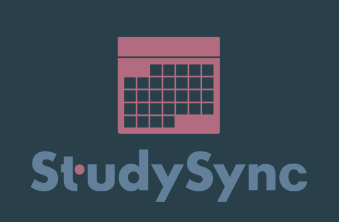
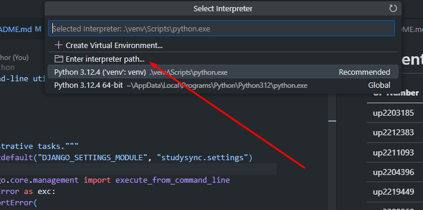
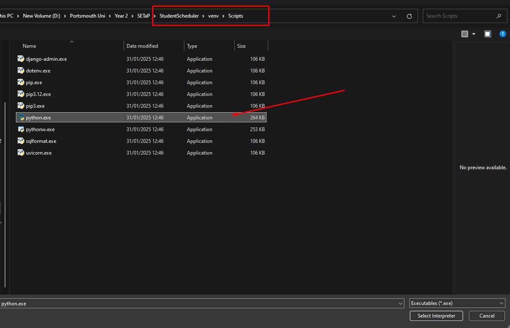

# StudentScheduler
| UP Number | GitHub Username |
|-----------|----------------------|
| up2203185 | hmortimore69 |
| up2212383 | justinuni5 |
| up2211093 | gabtendelski |
| up2204396 | ElliotRichardson8 |
| up2219449 | ndunami |
| up2208860 | up2208860 |

## Setup Instructions

### Virtual Environment Setup

To ensure the proper setup of the project, **you must run the `start.bat` file once** to create the virtual environment (venv).

If you prefer not to run the batch file each time to get access to the modules, you can either:

-   Set your Python interpreter path in **VSCode** to `/venv/Scripts/python.exe`.
-   Or manually activate the virtual environment by running `/venv/Scripts/activate` in your terminal.

----------

### Project Setup

1.  **Create the `.env` file**  
    Use the provided `.env.sample` template to create your own `.env` file.
    
2.  **Configure PostgreSQL**  
    Add your PostgreSQL database details (such as username, password, and database name) to the newly created `.env` file.
    
3.  **Start the Server**  
    Run `start.bat` to ensure the server starts correctly and the necessary dependencies are installed.
    

----------

### Visual Aids

Below are images that show how to set your VSCode Python interpreter path.

Step 1:

  

Step 2:

  

Step 3:

  

----------