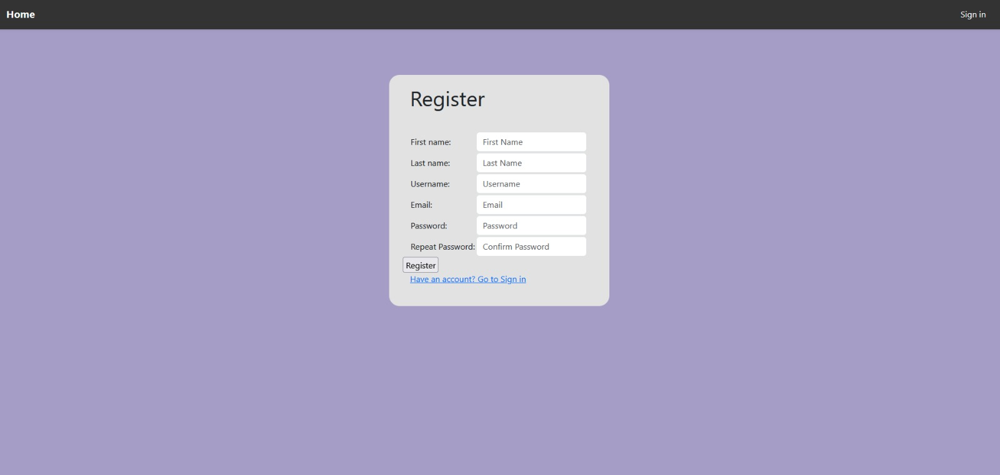
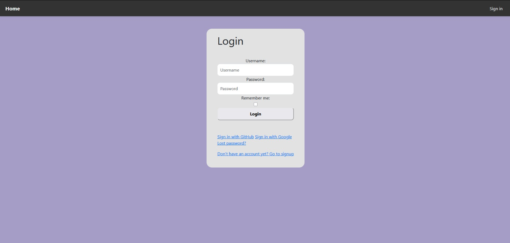
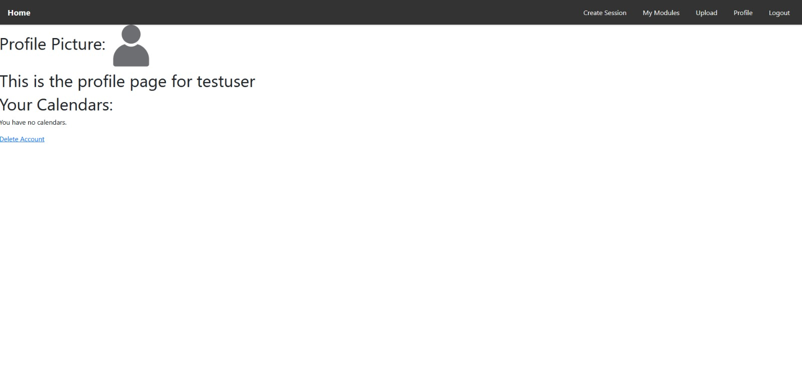
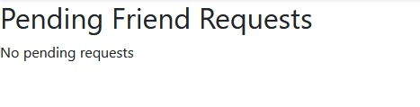
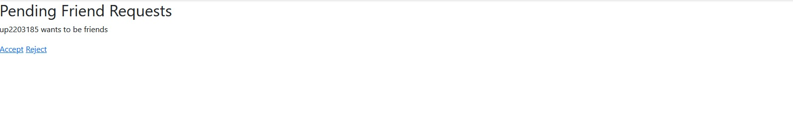
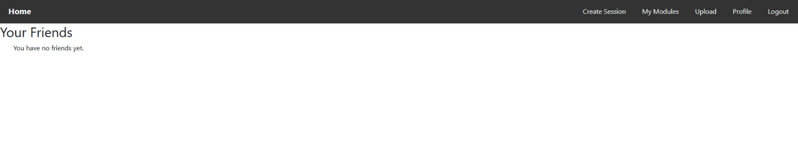
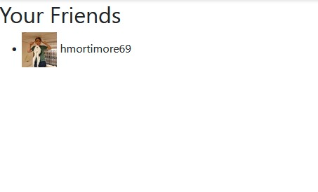

StudySync documentation!
========================

Welcome to StudySync documentation.

StudySync is a collaborative web application designed to transform the way students connect, study, and succeed together. Unlike traditional study groups or generic messaging platforms, StudySync provides a structured, scalable environment tailored specifically for academic collaboration. The platform makes it easy to find or create study groups based on courses, availability, and preferred study methods-removing the friction from group formation and scheduling.

===============================
Login and Accounts
===============================

.. module:: users.views

Overview
--------

This module provides user authentication and account management for StudySync. It uses Django's authentication system, custom forms, and session management to ensure a secure and user-friendly experience. The design emphasizes both ease of use and protection against accidental or unauthorized actions.

Usage
=====

Registration
------------

Registration allows new users to create an account on StudySync. The process is designed to be simple while enforcing strong validation on user data. Maintenance involves ensuring that the registration form stays up-to-date with any changes to the user model and that validation rules match security best practices.

- Users register via the ``/register/`` page.
- Registration uses a custom form (``RegisterForm``). On success, the user is redirected to the home page.

.. code-block:: python

   # Registering an Account
   class RegisterView(View):
      form_class = RegisterForm
      initial = {"key": "value"}
      template_name = "registration/register.html"

      def get(self, request, *args, **kwargs):
         form = self.form_class(initial=self.initial)
         return render(request, self.template_name, {"form": form})

      def post(self, request, *args, **kwargs):
         form = self.form_class(request.POST)
         if form.is_valid():
               form.save()
               return redirect(to="/")
         return render(request, self.template_name, {"form": form})

Login
-----

Login provides secure access to user accounts. The login system supports both persistent sessions ("remember me") and sessions that expire when the browser closes. Maintenance includes keeping authentication mechanisms secure and updating third-party login options as needed.

Log In Options:
   * Log into Existing Account
   * Log in using GitHub
   * Log in using Google

- Users log in via a custom login page (``CustomLoginView``) with optional "remember me" functionality.

Remember Me Functionality
-------------------------

The "remember me" feature allows users to choose whether their session persists after closing the browser. This enhances usability for personal devices and security for shared computers. Maintenance involves ensuring session expiry settings are correctly configured and tested after updates.

- If "remember me" is not selected, the session expires when the browser closes.

.. code-block:: python

   class CustomLoginView(LoginView):
      form_class = LoginForm

      def form_valid(self, form):
         remember_me = form.cleaned_data.get("remember_me")
         if not remember_me:
               self.request.session.set_expiry(0)
               self.request.session.modified = True
         return super(CustomLoginView, self).form_valid(form)

Profile and Account Deletion
============================

The profile page provides access to user-specific features and settings. Account deletion is intentionally a multi-step process to prevent accidental data loss. Maintenance includes verifying that session flags and navigation flows work as intended after any updates.

- Users can view their profile at ``/profile/``.
- Users can view their calendar if they have one linked.
- Users have access to "Create Session", "My Modules", "Upload" and "Log out" for seamless navigation.

.. code-block:: python

   # Viewing Account
   @login_required
   def profile_view(request):
      request.session['from_profile'] = True
      return render(request, "users/profile.html")

Deleting Account
----------------

Account deletion is protected by session-based navigation. Users must visit both the profile and confirmation pages before deletion is allowed. This approach prevents accidental or unauthorized deletions. Maintenance requires testing the navigation flow and session logic after changes.

.. image:: delete_account.jpg
   :width: 800
   :alt: Delete Account Confirmation

- Account deletion requires visiting the profile and confirmation pages in order.

.. code-block:: python

   # Deleting Account
   @login_required
   def delete_account_confirmation_view(request): 
      if not request.session.get('from_profile', False):
         return redirect(to="/profile")
      request.session["can_delete_account"] = True 
      return render(request, "registration/delete_account_confirmation.html")

   @login_required
   def delete_account(request):
      if not request.session.get("can_delete_account", False):
         return redirect(to="/profile")
      if request.method == "POST":
         request.session["can_delete_account"] = False 
         user = request.user
         user.delete()
         return redirect(to="/")
      return redirect(to="/profile")

Troubleshooting
---------------

This section provides solutions for common issues users or maintainers might encounter. Regularly updating troubleshooting steps ensures smooth operation and helps new maintainers quickly resolve user problems.

- If account deletion redirects unexpectedly, ensure session flags are being set correctly by visiting the profile and confirmation pages in order.
- If friend requests are not appearing, check for duplicate requests or incorrect user IDs.
- For login issues, verify that the custom login form inherits from Django's ``AuthenticationForm`` and includes the "remember me" field.

=========
Social
=========

The social features in StudySync enable users to connect, collaborate, and build academic communities. Maintenance focuses on ensuring data integrity (e.g., no duplicate requests) and keeping the user experience smooth as the user base grows.

Friend Requests
---------------

Friend requests allow users to connect with peers for collaboration. The system ensures that requests are not duplicated and that only valid connections are established. Maintenance involves monitoring the friend request workflow and updating logic as needed for scalability.

- Users can send friend requests to others.
- Requests can be accepted or rejected. Accepted users are added to each other's friends lists.

Sending a Friend Request
------------------------

Sending a friend request is straightforward and can be done by username or email. The backend checks for existing requests to prevent duplicates. Maintenance includes ensuring efficient database queries and handling exceptions gracefully.

- Users can add friends directly using their username or via email.

.. code-block:: python

   # Sending Friend Request
   def send_friend_request(request, user_id):
      to_user = get_object_or_404(CustomUser, id=user_id)
      from_user = request.user
      if FriendRequest.objects.filter(from_user=from_user, to_user=to_user).exists():
         return redirect('user_list')
      try:
         FriendRequest.objects.create(from_user=from_user, to_user=to_user, status='pending')
         print("Friend request created successfully!") 
      except Exception as e:
         print(f"Error creating friend request: {e}") 
      return redirect('user_list')

Responding to Friend Requests
----------------------------

Users can accept or reject incoming friend requests. Accepting a request adds both users to each other's friends lists, while rejecting prevents future interactions. Maintenance includes verifying that only the intended recipient can respond and that both users' lists are updated correctly.

- Users can choose to "accept" or "reject" an incoming friend request.
- Accepting adds the user to your friends list; rejecting prevents interaction.

.. code-block:: python

   # Responding to Friend Request
   def respond_request(request, request_id, action):
      friend_request = get_object_or_404(FriendRequest, id=request_id)
      if request.user != friend_request.to_user:
         return redirect('home')
      if action == 'accept':
         friend_request.status = 'accepted'
         friend_request.save()
         request.user.friends.add(friend_request.from_user)
         friend_request.from_user.friends.add(request.user)
      elif action == 'reject':
         friend_request.status = 'rejected'
         friend_request.save()
      return redirect('friend_requests')

Friend Requests List
--------------------

This view displays all pending friend requests for the user. Maintenance involves ensuring the list is accurate and efficiently queried, especially as the number of users grows.

.. code-block:: python

   # Friend Requests
   def friend_requests(request):
      requests = FriendRequest.objects.filter(
         to_user=request.user,
         status='pending'
      )
      return render(request, 'users/friend_requests.html', {'requests': requests})

Friends List
------------

The friends list page shows all confirmed friends for the user. If there are no friends, the page will indicate this. Maintenance includes keeping the friends relationship consistent and updating the UI as needed.

This is what the friends list page looks like when the user has no friends currently added.

This is what the friends list page appears like when the user has friends added.

.. code-block:: python

   # Friends List
   def friends_list(request):
      friends = request.user.friends.all()
      return render(request, 'users/friends.html', {'friends': friends})

Friend Request Integrity
-----------------------

Integrity checks prevent duplicate friend requests and ensure that both users' friends lists are updated upon acceptance. Maintenance includes reviewing logic for edge cases and ensuring the database reflects the intended relationships.

- Duplicate friend requests are prevented by checking for existing requests.
- Accepting a request updates both users' friends lists for consistency.

User List
---------

The user list page allows users to discover and connect with others who are not yet friends and have no pending requests. Maintenance involves optimizing queries for performance and ensuring privacy by excluding inappropriate users.

.. image:: user_image.jpg
   :width: 200
   :alt: User Discovery Page

- Users can search for others and send friend requests.

.. code-block:: python

   # User List
   def user_list(request):
      current_user = request.user
      friends = current_user.friends.all()
      sent_requests = FriendRequest.objects.filter(from_user=current_user).values_list('to_user', flat=True)
      received_requests = FriendRequest.objects.filter(to_user=current_user).values_list('from_user', flat=True)
      users = CustomUser.objects.exclude(id=current_user.id).exclude(id__in=friends).exclude(id__in=sent_requests).exclude(id__in=received_requests)
      return render(request, 'users/user_list.html', {'users': users})

==============
Additional Links
==============

- `GitHub Repository <https://github.com/UoP-1A>`_
- `Test Plans <https://docs.google.com/spreadsheets/d/16E_DPLyooj764T2RZqr4ZyrxSfrkw6ebbUSg-dzVfso/edit?gid=0#gid=0>`_
