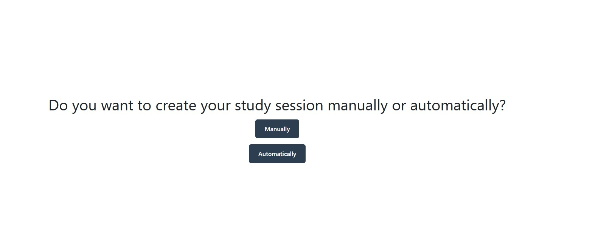
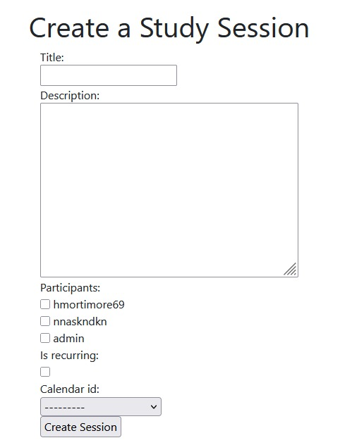
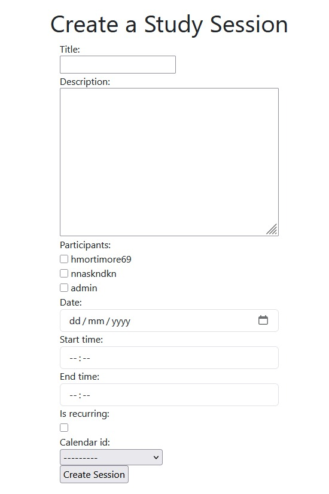
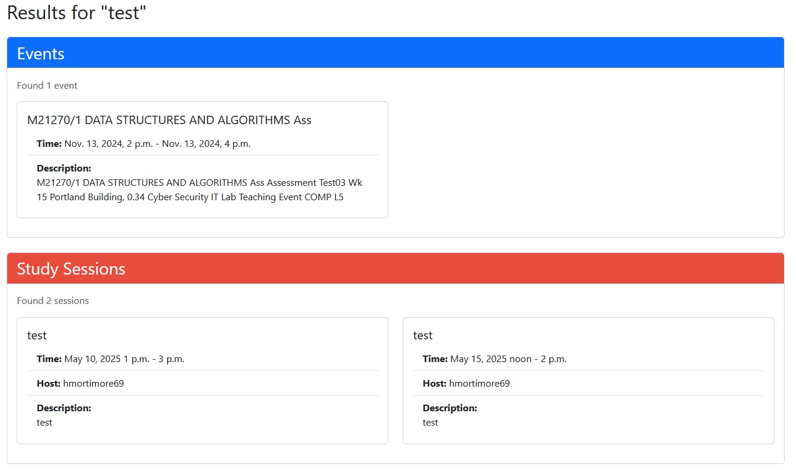

===============================
StudySync documentation!
========================

Welcome to StudySync documentation.

StudySync is a collaborative web application designed to transform the way students connect, study, and succeed together. Unlike traditional study groups or generic messaging platforms, StudySync provides a structured, scalable environment tailored specifically for academic collaboration.

Login and Accounts
===============================

.. module:: users.views

Overview
--------

This app provides user authentication and account management for StudySync. It uses Django's authentication system, custom forms, and session management to ensure a secure and user-friendly experience. The design emphasises both ease of use and protection against accidental or unauthorised actions.

Usage
-----------

Registration
------------

Registration allows new users to create an account on StudySync. The process is designed to be simple while enforcing strong validation on user data. Maintenance involves ensuring that the registration form stays up-to-date with any changes to the user model and that validation rules match security best practices.

- Users register via the register page.
- Registration uses a custom form (RegisterForm). On success, the user is redirected to the home page.

.. code-block:: python

   # Registering an Account
   class RegisterView(View):
      form_class = RegisterForm
      initial = {"key": "value"}
      template_name = "registration/register.html"

      def get(self, request, *args, **kwargs):
         form = self.form_class(initial=self.initial)
         return render(request, self.template_name, {"form": form})

      def post(self, request, *args, **kwargs):
         form = self.form_class(request.POST)
         if form.is_valid():
               form.save()
               return redirect(to="/")
         return render(request, self.template_name, {"form": form})

Login
-----

Login provides secure access to user accounts. The login system supports both persistent sessions ("remember me") and sessions that expire when the browser closes. Maintenance includes keeping authentication mechanisms secure and updating third-party login options as needed.

Log In Options:
   * Log into Existing Account
   * Log in using GitHub
   * Log in using Google

- Users log in via a custom login page (CustomLoginView) with optional "remember me" functionality.

Logout
----------------

This allows the user to log out of the app if they decide to no longer use the app.

.. image:: log_out_page.jpeg
   :width: 500
   :alt: log out page

Remember Me Functionality
-------------------------

The "remember me" feature allows users to choose whether their session persists after closing the browser. This enhances usability for personal devices and security for shared computers. Maintenance involves ensuring session expiry settings are correctly configured and tested after updates.

- If "remember me" is not selected, the session expires when the browser closes.

.. code-block:: python

   class CustomLoginView(LoginView):
      form_class = LoginForm

      def form_valid(self, form):
         remember_me = form.cleaned_data.get("remember_me")
         if not remember_me:
               self.request.session.set_expiry(0)
               self.request.session.modified = True
         return super(CustomLoginView, self).form_valid(form)

Profile and Account Deletion
============================

The profile page provides access to user-specific features and settings. Account deletion is intentionally a multi-step process to prevent accidental data loss. Maintenance includes verifying that session flags and navigation flows work as intended after any updates.

.. image:: new_profile.jpeg
   :width: 500
   :alt: Profile Page

- Users can view their profile at (profile).
- Users can view their calendar if they have one linked.
- Users have access to "Create Session", "My Modules", "Upload" and "Log out" for seamless navigation.

.. code-block:: python

   # Viewing Account
   @login_required
   def profile_view(request):
      request.session['from_profile'] = True
      return render(request, "users/profile.html")

Deleting Account
----------------

Account deletion is protected by session-based navigation. Users must visit both the profile and confirmation pages before deletion is allowed. This approach prevents accidental or unauthorised deletions. Maintenance requires testing the navigation flow and session logic after changes.

.. image:: delete_account.jpg
   :width: 800
   :alt: Delete Account Confirmation

- Account deletion requires visiting the profile and confirmation pages in order.

.. code-block:: python

   # Deleting Account
   @login_required
   def delete_account_confirmation_view(request): 
      if not request.session.get('from_profile', False):
         return redirect(to="/profile")
      request.session["can_delete_account"] = True 
      return render(request, "registration/delete_account_confirmation.html")

   @login_required
   def delete_account(request):
      if not request.session.get("can_delete_account", False):
         return redirect(to="/profile")
      if request.method == "POST":
         request.session["can_delete_account"] = False 
         user = request.user
         user.delete()
         return redirect(to="/")
      return redirect(to="/profile")

Social
=========

The social features in StudySync enable users to connect, collaborate. Maintenance focuses on ensuring data integrity (e.g., no duplicate requests) and keeping the user experience smooth as the user base grows.

Friend Requests
---------------

Friend requests allow users to connect with peers for collaboration. The system ensures that requests are not duplicated and that only valid connections are established. Maintenance involves monitoring the friend request workflow and updating logic as needed for scalability.

- Users can send friend requests to others.
- Requests can be accepted or rejected. Accepted users are added to each other's friends lists.

Sending a Friend Request
------------------------

Sending a friend request is straightforward and can be done by username or email. The backend checks for existing requests to prevent duplicates. Maintenance includes ensuring efficient database queries and handling exceptions gracefully.

- Users can add friends directly using their username or via email.

.. code-block:: python

   # Sending Friend Request
   def send_friend_request(request, user_id):
      to_user = get_object_or_404(CustomUser, id=user_id)
      from_user = request.user
      if FriendRequest.objects.filter(from_user=from_user, to_user=to_user).exists():
         return redirect('user_list')
      try:
         FriendRequest.objects.create(from_user=from_user, to_user=to_user, status='pending')
         print("Friend request created successfully!") 
      except Exception as e:
         print(f"Error creating friend request: {e}") 
      return redirect('user_list')

Responding to Friend Requests
----------------------------

Users can accept or reject incoming friend requests. Accepting a request adds both users to each other's friends lists, while rejecting prevents future interactions. Maintenance includes verifying that only the intended recipient can respond and that both users' lists are updated correctly.

- Users can choose to "accept" or "reject" an incoming friend request.
- Accepting adds the user to your friends list; rejecting prevents interaction.

.. code-block:: python

   # Responding to Friend Request
   def respond_request(request, request_id, action):
      friend_request = get_object_or_404(FriendRequest, id=request_id)
      if request.user != friend_request.to_user:
         return redirect('home')
      if action == 'accept':
         friend_request.status = 'accepted'
         friend_request.save()
         request.user.friends.add(friend_request.from_user)
         friend_request.from_user.friends.add(request.user)
      elif action == 'reject':
         friend_request.status = 'rejected'
         friend_request.save()
      return redirect('friend_requests')

Friend Requests List
--------------------

This view displays all pending friend requests for the user. Maintenance involves ensuring the list is accurate and efficiently queried, especially as the number of users grows.

.. code-block:: python

   # Friend Requests
   def friend_requests(request):
      requests = FriendRequest.objects.filter(
         to_user=request.user,
         status='pending'
      )
      return render(request, 'users/friend_requests.html', {'requests': requests})

Friends List
------------

The friends list page shows all confirmed friends for the user. If there are no friends, the page will indicate this. Maintenance includes keeping the friends relationship consistent and updating the UI as needed.

This is what the friends list page looks like when the user has no friends currently added.

This is what the friends list page appears like when the user has friends added.

.. code-block:: python

   # Friends List
   def friends_list(request):
      friends = request.user.friends.all()
      return render(request, 'users/friends.html', {'friends': friends})

Friend Request Integrity

Integrity checks prevent duplicate friend requests and ensure that both users' friends lists are updated upon acceptance. Maintenance includes reviewing logic for edge cases and ensuring the database reflects the intended relationships.

- Duplicate friend requests are prevented by checking for existing requests.
- Accepting a request updates both users' friends lists for consistency.

User List
---------

The user list page allows users to discover and connect with others who are not yet friends and have no pending requests. Maintenance involves optimsing queries for performance and ensuring privacy by excluding inappropriate users.

.. image:: user_image.jpg
   :width: 200
   :alt: User Discovery Page

- Users can search for others and send friend requests.

.. code-block:: python

   # User List
   def user_list(request):
      current_user = request.user
      friends = current_user.friends.all()
      sent_requests = FriendRequest.objects.filter(from_user=current_user).values_list('to_user', flat=True)
      received_requests = FriendRequest.objects.filter(to_user=current_user).values_list('from_user', flat=True)
      users = CustomUser.objects.exclude(id=current_user.id).exclude(id__in=friends).exclude(id__in=sent_requests).exclude(id__in=received_requests)
      return render(request, 'users/user_list.html', {'users': users})

Module
================

Overview
--------

The Module component of StudySync allows users to manage their academic modules and track their grades for each module. This system enforces limits on module and grade creation, calculates weighted averages, and provides robust validation to ensure data integrity. It is designed to help students organise their coursework and monitor their academic progress in a structured way.

Usage
--------

Module and Grade Models
-----------------------

Modules represent individual courses or subjects a user is enrolled in, while Grades represent assessments within those modules. Each module belongs to a user and can have multiple grades, each with a mark and a weight.

**Typical usage:**
- Users can add up to 6 modules.
- Each module can have multiple grades (e.g., assignments, exams).
- The system calculates a weighted average for each module based on the grades.

.. code-block:: python

   class Module(models.Model):
       user = models.ForeignKey(CustomUser, related_name="modules", on_delete=models.CASCADE)
       name = models.CharField(max_length=50)
       credits = models.IntegerField(default=0)

       def overall_grade(self):
           grades = self.grades.all()
           if not grades:
               return None
           total_weight = sum(grade.weight for grade in grades)
           if total_weight == 0:
               return None
           weighted_sum = sum(grade.mark * grade.weight for grade in grades)
           return round(weighted_sum / total_weight, 2)

       def save(self, *args, **kwargs):
           if (self.user.modules.count() >= 6 or self.user.modules.count() <= -1) and not self.pk:
               raise ValidationError("A user can only have between 0 and 6 modules inclusive.")
           super().save(*args, **kwargs)

       def __str__(self):
           return f"{self.name}"

   class Grade(models.Model):
       module = models.ForeignKey(Module, related_name="grades", on_delete=models.CASCADE)
       name = models.CharField(max_length=100)
       mark = models.FloatField()
       weight = models.FloatField()

       def save(self, *args, **kwargs):
           total_weight = sum(grade.weight for grade in self.module.grades.exclude(pk=self.pk)) + self.weight

           if total_weight < 0 or total_weight > 100:
               raise ValidationError("This exceeds the total allowed weight of 100.")
       
           super().save(*args, **kwargs)

       def __str__(self):
           return f"Assessment: {self.name} Mark: {self.mark}"

Maintenance
---------------

The module and grade logic relies on Django’s ORM for data integrity and on custom validation in the `save` methods. To maintain this system:
- Regularly test the module and grade limits.
- Ensure that changes to the user or grade models do not break validation logic.
- Monitor for exceptions raised during module or grade creation, as these indicate user or data errors that should be handled gracefully.

=======================
Module Management Views
=======================

Get Modules
-----------

This view retrieves all modules for the logged-in user and prepares forms for adding new modules or grades. It is the main entry point for users to view and manage their modules.

.. code-block:: python

   @login_required
   @api_view(['GET'])
   def get_modules(request):
       user = request.user
       modules = user.modules.all()
       module_form = ModuleCreateForm()
       grade_form = GradeCreateForm()

       return render(request, "modules/modules.html", {
           "modules": modules,
           "module_form": module_form,
           "grade_form": grade_form,
       })

**Usage:**  
Users visit the modules page to see all their modules and add new ones.

**Maintenance:**  
Keep forms updated if the module or grade fields change. Ensure the template displays validation errors clearly.

Add Module
----------

Allows users to add a new module, enforcing the maximum module limit. If the user already has 6 modules, an error is shown.

.. code-block:: python

   @login_required
   @api_view(['POST'])
   def add_module(request):
       module_form = ModuleCreateForm(request.POST)
       if module_form.is_valid():
           try:
               Module.objects.create(
                   user=request.user,
                   name=module_form.cleaned_data['name'], 
                   credits=module_form.cleaned_data['credits'],
               )
           except ValidationError as e:
               module_form.add_error(None, e.message)
               messages.error(request, "Failed to add module: " + str(e))
               return render(request, 'modules/modules.html', {'module_form': module_form})
           
           return redirect("/modules")

**Usage:**  
Submit the module creation form to add a new course.

**Maintenance:**  
Validate that the module count logic remains correct if the module model is extended.

Add Grade
---------

Enables users to add a grade to a module, ensuring that the total weight does not exceed 100. If the limit is exceeded, an error is returned.

.. code-block:: python

   @login_required
   @api_view(['POST'])
   def add_grade(request):
       grade_form = GradeCreateForm(request.POST)
       if grade_form.is_valid():
           try:
               Grade.objects.create(
                   module=grade_form.cleaned_data['module'],
                   name=grade_form.cleaned_data['name'],
                   mark=grade_form.cleaned_data['mark'],
                   weight=grade_form.cleaned_data['weight'],
               )
           except ValidationError as e:
               grade_form.add_error(None, e.message)
               messages.error(request, "Failed to add grade: " + str(e))
               return render(request, 'modules/modules.html', {'grade_form': grade_form})
           
           return redirect("/modules")

**Usage:**  
Add a grade for a specific module, specifying the mark and weight.

**Maintenance:**  
Ensure the grade form and validation logic are kept in sync with assessment policies.

Delete Module
-------------

Allows users to remove a module. Associated grades are also deleted due to the `on_delete=models.CASCADE` behavior.

.. code-block:: python

   @login_required
   @api_view(['POST'])
   def delete_module(request, module_id):
       module = get_object_or_404(Module, id=module_id, user=request.user)

       module.delete()
       messages.success(request, "Module deleted successfully.")

       return redirect("/modules")

**Usage:**  
Users can delete a module they no longer need.

**Maintenance:**  
Test that grades are also deleted and that only the module owner can perform this action.

Delete Grade
------------

Allows users to remove a specific grade from a module.

.. code-block:: python

   @login_required
   @api_view(['POST'])
   def delete_grade(request, grade_id):
       grade = get_object_or_404(Grade, id=grade_id)

       grade.delete()
       messages.success(request, "Grade deleted successfully.")

       return redirect("/modules")

**Usage:**  
Delete a grade from a module if it was entered incorrectly or is no longer relevant.

**Maintenance:**  
Ensure grade deletion does not affect the module’s integrity or overall grade calculation.

Calendar
================

Overview
--------

The Calendar feature in StudySync is designed to help users efficiently organise their academic schedules, manage important deadlines, and coordinate study sessions with peers. Its intuitive interface makes it easy for students to stay on top of their coursework and collaborate with others.

Usage
-----------

The Calendar allows users to:

- **Create, view, and edit study sessions** directly from their dashboard.
- **Link events to specific modules or courses** for better organisation.
- **Invite friends or study group members** to shared events, making collaborative planning seamless.
- **Receive reminders and notifications** for upcoming sessions, helping users stay on track.

**How to Use:**

1. **Access the Calendar** from your dashboard or the main navigation menu.
2. **Add a new event** by selecting a date and filling in details such as the module, event title, time, and invitees.
3. **Edit or delete events** as your schedule changes.
4. **View all your upcoming events** in a daily, weekly, or monthly format.

This integration with modules and social features ensures that academic planning is both comprehensive and user-friendly.

Maintenance
-----------

Maintaining the Calendar involves:

- **Ensuring event data is synchronised** across all user devices and among group members.
- **Managing time zones** so events display correctly for all participants.
- **Delivering notifications and reminders** reliably and on time.
- **Updating the interface and features** based on user feedback and academic calendar changes.

Regular testing and updates are performed to ensure the Calendar remains accurate, user-friendly, and responsive to the needs of the StudySync community.

Notifications
================

Overview
--------

The Notifications feature in StudySync keeps users informed about important updates, such as new friend requests, upcoming study sessions, or changes to group events. Notifications are designed to ensure users never miss critical information and can respond promptly to academic and social activities.

Usage
----------

Notifications allow users to:

- **Receive alerts** for events like friend requests, session invitations, and reminders.
- **View all notifications** in a dedicated notifications page, accessible from the main navigation.
- **Mark notifications as read** to keep their notification list organised and manageable.

**How to Use:**

1. **Access Notifications:**  
   Click on the notifications icon or link in your dashboard to view all your notifications.

2. **Read Notifications:**  
   Notifications are displayed in chronological order. Unread notifications are highlighted for easy identification.

3. **Mark as Read:**  
   Click the "Mark as Read" button on a notification to acknowledge it. This helps keep your feed organised and ensures you focus on new updates.

.. code-block:: python

   # Example: Viewing notifications
   @login_required
   def notifications_view(request):
       notificationsList = Notification.objects.filter(user=request.user).order_by('timestamp')
       return render(request, 'notifications/notifications.html', {'notificationsList': notificationsList})

   # Example: Marking a notification as read
   @require_POST
   @login_required
   def mark_as_read(request, notification_id):
       notification = get_object_or_404(Notification, id=notification_id, user=request.user)
       notification.is_read = True
       notification.save()
       return redirect('notifications')

Study Sessions
==============

Overview
--------

The Study Sessions feature in StudySync empowers users to efficiently organise, join, and manage collaborative study events. Users can create sessions manually or automatically, add participants, and set up recurring meetings. Study sessions are tightly integrated with the calendar, making it easy to visualise and plan academic activities. The system helps students avoid scheduling conflicts, maximise productivity, and foster teamwork.

What Users Can Do
-----------------

- Create study sessions manually or let StudySync automatically find the best time based on their existing schedule.
- Add friends or group members as participants to sessions.
- Set up one-off or recurring study sessions.
- View all their sessions-both those they host and those they attend-in their calendar.
- Avoid double-booking and easily spot schedule overlaps.

Creating a Study Session
------------------------

Users can start the process by choosing whether to create a session manually or let StudySync suggest an optimal slot.

.. code-block:: python

   @login_required
   @csrf_exempt
    def create(request, automated=0):
        if automated == 0:
            form = ManualStudySessionForm
        else:
            form = AutoStudySessionForm
        if request.method == 'POST':
            print(request.POST)
            if automated == 0:
                form = ManualStudySessionForm(request.POST)
            else:
                form = AutoStudySessionForm(request.POST)
            if form.is_valid():
                study_session = form.save(commit=False)
                study_session.host = request.user
                if automated == 1:
                    events = []
                    #urls = ['study_sessions:get_sessions']
                    urls = ['study_sessions:get_sessions', 'prep_events']

                    #fetch all events and sessions from the calendar
                    for url_name in urls:
                        url = request.build_absolute_uri(reverse(url_name))
                        response = requests.get(url, cookies=request.COOKIES)
                        if response.status_code == 200:
                            data = response.json()
                            for item in data:
                                rrule = str(item.get('rrule'))
                                rrule_count = 0
                                if rrule != "None":
                                    rrule_split = rrule.split(';')
                                    for rrule_item in rrule_split:
                                        if rrule_item.startswith('COUNT='):
                                            rrule_count = int(rrule_item.split('=')[1])
                                    if rrule_count == 1:
                                        start = parse_datetime(item.get('start'))
                                        end = parse_datetime(item.get('end'))
                                        if(url_name == 'study_sessions:get_sessions'):
                                            start = make_aware(start)
                                            end = make_aware(end)
                                        else:
                                            start = localtime(start)
                                            end = localtime(end)

                                        session_data = {
                                            'start': str(start),
                                            'end': str(end),
                                        }
                                        events.append(session_data)

                                    else:
                                        for i in range(rrule_count):
                                            start = parse_datetime(item.get('start'))
                                            end = parse_datetime(item.get('end'))
                                            start = (start + timedelta(weeks=i))
                                            end = (end + timedelta(weeks=i))
                                            if(url_name == 'study_sessions:get_sessions'):
                                                start = make_aware(start)
                                                end = make_aware(end)
                                            else:
                                                start = localtime(start)
                                                end = localtime(end)
                                            session_data = {
                                                'start': str(start),
                                                'end': str(end),
                                            }
                                            events.append(session_data)

                                else:
                                    start = parse_datetime(item.get('start'))
                                    end = parse_datetime(item.get('end'))
                                    if(url_name == 'study_sessions:get_sessions'):
                                        start = make_aware(start)
                                        end = make_aware(end)
                                    else:
                                        start = localtime(start)
                                        end = localtime(end)
                                    session_data = {
                                        'start': str(start),
                                        'end': str(end),
                                    }
                                    events.append(session_data)

**Usage:**  
When users navigate to the study session creation page, they are prompted to select between manual and automatic creation. This makes scheduling flexible for both planners and those who prefer automated convenience.

**Maintenance:**  
Ensure the selection interface is clear and that both creation paths are tested after updates.

Adding Participants
-------------------

Participants can be added during session creation. The system ensures no duplicate participation and checks for overlaps in participants' schedules.

.. code-block:: python

   participants = form.cleaned_data['participants']
   for participant in participants:
       StudySessionParticipant.objects.create(study_session=study_session, participant=participant)

**Usage:**  
Users can invite friends or group members to join a session. If a participant already has an event at the proposed time, the system will highlight the overlap, allowing users to adjust accordingly.

**Maintenance:**  
Maintain unique constraints and overlap checks to prevent double-booking and ensure a smooth scheduling experience.

Automatic Study Sessions
------------------------

Automatic study session creation analyses the user's (and optionally, participants') schedules and finds the optimal time slot for a new session within the week. The system avoids days with no events (to allow for rest) and prefers days with the least scheduled hours.

.. code-block:: python

   @login_required
    def create_recurring(request, session_id):
        # Get session or return 404
        session = get_object_or_404(StudySession, id=session_id)
        
        # Verify permissions
        if session.host != request.user:
            raise PermissionDenied
            
        # Verify session is marked as recurring
        if not session.is_recurring:
            return HttpResponseBadRequest("Session must be marked as recurring")

        if request.method == 'POST':
            form = RecurringSessionForm(request.POST)
            if form.is_valid():
                recurring_session = form.save(commit=False)
                recurring_session.session_id = session
                recurring_session.save()
                return redirect('index')
        else:
            form = RecurringSessionForm()

        return render(request, 'study_sessions/create_recurring.html', {
            'form': form,
            'session': session
        })

**Usage:**  
Users simply select "Automatic" and StudySync will suggest a session time based on their availability, minimising conflicts and balancing workload.

**Maintenance:**  
Keep the time analysis logic up-to-date with any changes to event/session models. Test with various calendar scenarios to ensure the algorithm finds reasonable slots.

Manual Study Sessions
---------------------

Manual creation allows users to directly specify the date, start time, end time, and participants for their session.

.. code-block:: python

   if automated == 0:
       form = ManualStudySessionForm(request.POST)
       if form.is_valid():
           study_session = form.save(commit=False)
           study_session.host = request.user
           study_session.save()
           # Add participants...

**Usage:**  
Ideal for users who already know when they want to meet or need to schedule around specific constraints.

**Maintenance:**  
Ensure form validation is robust and that user input is correctly reflected in the session details.

Search Bar
==========

Overview
--------

The Search Bar feature in StudySync allows users to quickly find events and study sessions by keyword. It provides a unified, user-friendly search experience across both one-time and recurring events, helping users stay organised and easily locate relevant academic activities.

View: search_results
--------------------

.. code-block:: python

   @login_required
   def search_results(request):
       query = request.GET.get('q')
       combined_results = []
       session_results = []

       if query:
           event_results = Event.objects.filter(
               Q(title__icontains=query) | 
               Q(start__icontains=query) |
               Q(description__icontains=query)
           ).distinct().order_by('-start')

           recurring_events = []

           now_time = datetime.now() - timedelta(days=365)
           oneYear = datetime.now()

           for event in Event.objects.exclude(rrule__isnull=True).exclude(rrule=""):
               rule = rrulestr(event.rrule, dtstart=event.start)
               occurrences = list(rule.between(now_time, oneYear, inc=True))

               for occurrence in occurrences:
                   if query.lower() in event.title.lower() or query.lower() in event.description.lower():
                       recurring_events.append({
                           'id': event.id,
                           'title': event.title,
                           'start': occurrence,
                           'end': occurrence + (event.end - event.start),
                           'description': event.description
                       })

           combined_results = list(event_results.values('id', 'title', 'start', 'end', 'description'))
           combined_results.extend(recurring_events) 

           session_results = StudySession.objects.filter(
               Q(title__icontains=query) | 
               Q(start_time__icontains=query)       
           ).distinct().order_by('-start_time')

       return render(request, 'search_results.html', {
           'query': query, 
           'event_results': combined_results, 
           'session_results': session_results, 
           'event_results_count': len(combined_results), 
           'session_results_count': len(session_results)
       })

**Usage:**  
Users can enter a keyword or phrase into the search bar on the StudySync dashboard. The system will return a list of matching events (including recurring events) and study sessions. This enables users to quickly locate sessions or events by title, description, or start time.

- Search results include both one-time and recurring events.
- Study sessions are also included if their title or start time matches the query.
- Results are displayed in a dedicated search results page, grouped and counted for clarity.

**Maintenance:**  
- Ensure the search indexes all relevant fields (title, description, start time).
- Update search logic if new searchable fields are added to events or study sessions.
- Periodically review performance, especially as the number of events and sessions grows.
- Maintain compatibility with recurring event logic to ensure all relevant occurrences are searchable.

Additional Links
==============

- `GitHub Repository <https://github.com/UoP-1A>`_
- `Test Plans <https://docs.google.com/spreadsheets/d/16E_DPLyooj764T2RZqr4ZyrxSfrkw6ebbUSg-dzVfso/edit?gid=0#gid=0>`_
